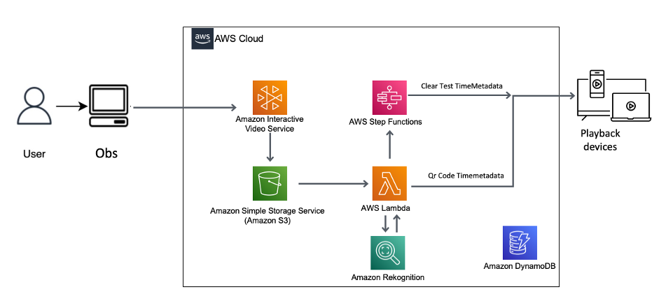

# Interactive Advertising with Amazon Interactive Video Service (IVS)

The media world is constantly changing and the new possibilities that AWS offers in this field allow you to create innovative solutions using cutting-edge technologies. One of the current challenges experienced by both users and operators of live streaming platforms is the ability to monetize content. Many times, social platforms don't give you the possibility to control the advertising you want to show within your live stream or show.

This repository is born to support the following [AWS Blog Post: Interactive advertising with Amazon IVS](https://aws.amazon.com/blogs/).
In the blog post we demonstrate how to recognize objects present during a live video stream, and to show the end user a banner with a QR code that allows them to learn more about or purchase the recognized product.

## Overview

We use an [Amazon Rekognition custom label](https://aws.amazon.com/rekognition/custom-labels-features/) to create our 2 product labels, and we begin the stream using software such as OBS to [Amazon IVS](https://aws.amazon.com/ivs/). The service stores in Amazon Simple Storage Service (S3) 1 picture every 5 seconds (you can tune this parameter). Each picture on S3 triggers an AWS Lambda function to analyze each image with the Amazon Rekognition custom model. If we find a match with one of our 2 product logos, we check if we already have the message on the screen or if we have had in the last 10 minutes (this is also tunable). If we aren’t in this situation, we can show using the [Amazon IVS timed metadata API](https://docs.aws.amazon.com/ivs/latest/userguide/metadata.html) to trigger the overlay message on the screen, and call an AWS Step Functions workflow to set the time to clear the message and time to resend other messages.

### Step by Step Solution

The following architecture details how we manage the interactive advertisment.



The workflow contains the following steps:

1. You start your Amazon Rekognition custom label model;
2. You start your streaming with software like OBS;
3. Amazon Interactive Video Service saves screenshot of the stream between every 5 and 60 seconds to an Amazon S3 bucket;
4. The .JPEG file triggers a Lambda function which calls Amazon Rekognition’s DetectCustomLabel API;
5. If Amazon Rekognition identifies the presence of one of the custom labels, the Lambda function checks if the advertising metadata is already present on the screen. If not, it calls the Amazon IVS PutMetadata API which instructs the player to display an overlay containing an image, a description, and a QR code for the product;
6. The Step Functions workflow is started to remove the message on the screen after 120 seconds, and reset all the counters after 600 second to avoid the flashing message on the screen;
7. All the information of the status of the message are stored in an Amazon DynamoDB table.

### Prerequisites

Before you begin setting up your stream, follow the steps in [Getting Started with Amazon IVS](https://docs.aws.amazon.com/ivs/latest/userguide/GSIVS.html) in the Amazon IVS User Guide to do the following:

1. Create an AWS account.
2. A couple of QR codes with links to external sites for product information ([here some examples](https://github.com/aws-samples/aws-interactive-advertising-ivs))

When you create an Amazon IVS channel, you get an ingest server and stream key. You use these to set up streaming. (You also get a Playback URL, to use later to play back your stream.)
The [Getting Started document](https://docs.aws.amazon.com/ivs/latest/userguide/GSIVS.html) also describes OBS Studio setup, specifically a setup using the OBS auto-configuration wizard. You can find a OBS configuration example in [this blog](https://aws.amazon.com/blogs/media/setting-up-for-streaming-with-amazon-ivs/). Alternatively, you can also use [your browser to stream directly to IVS](https://aws.amazon.com/blogs/media/broadcast-from-a-browser-with-the-amazon-ivs-web-broadcast-sdk/).

## Implementation Details

This README is not meant to be the full implementation guide. Indeed, all the details are contained in the [AWS Blog Post associated with this repository](https://aws.amazon.com/blogs/). For this reason, in this section *we are just summarizing the steps fully described in the blog post*.

### Create Amazon Rekognition Custom Label

As a first step you will need to create a Custom Label with Amazon Rekognition in the same region where you will create your Amazon Interactive Video Service channel.


### Create Amazon Interactive Video Service channel

Then you will need to create and configure an Amazon Interactive Video Service channel, providing also an Amazon Simple Storage Service bucket for storage purpuses.
 

### Create DynamoDB table

To track the recognized objects status - visualized or not - you will need to create a DynamoDB Table

### Create Lambda function for clear text message and TTL expired

In this step you will create a Lambda function that will be used by an Amazon Step Function (detailed in the next step) to to remove the video message after a certain amount of seconds and set a time in which no other ads are displayed (to avoid creating an intermittent effect).

- **Create lambda function “ivs-clear-text”**

    Code available at: [ivs_clear_text.py](https://github.com/aws-samples/aws-interactive-advertising-ivs/blob/main/Functions/ivs_clear_text.py).

    This function will clear the Amazon Interactive Video Service Channel Metadata. For this reason this function will need an AWS Role with the following Inline policy to be able to call the Amazon IVS *PutMetadata* API:
    ```
    {
        "Version": "2012-10-17",
        "Statement": [
    {
    "Sid": "VisualEditor0",
    "Effect": "Allow",
    "Action": "ivs:PutMetadata",
    "Resource": "arn:aws:ivs:*:*:channel/*"
    }
        ]
    }
    ```

    It is possible - and it is advised - to apply a more granular policy by specifying the ARN of the Amazon IVS channel created above such as: `arn:aws:ivs:AWS-REGION:ACCOUNT-ID:channel/CHANNEL-ID`.

    This function will also need an environmental variable called `IVSARN` with the value of the ARN of your, previously created, IVS channel (e.g., `arn:aws:ivs:AWS-REGION:ACCOUNT-ID:channel/CHANNEL-ID`)

- **<a name="Ivs-clear-ttxexpired-object1"></a>Create Lambda function “Ivs-clear-ttxexpired-object1”**

    Code available at: [Ivs-clear-ttxexpired-object1.py](https://github.com/aws-samples/aws-interactive-advertising-ivs/blob/main/Functions/ivs-clear-ttlexpired-object1.py).

    This function will track on Amazon DynamoDB which object is recognized by Amazon Rekognition and when it is displayed.
Also this function will need an AWS Role with an Inline Policies that allows the call of `dynamodb:UpdateItem` API:
    ```
    {
        "Version": "2012-10-17",
        "Statement": [
    {
    "Sid": "VisualEditor0",
    "Effect": "Allow",
    "Action": "dynamodb:UpdateItem",
    "Resource": "arn:aws:dynamodb:*:*:table/*"
    }
        ]
    }
    ```

    It is possible - and it is advised - to apply a more granular policy by specifying the ARN of the Amazon DynamoDB Table created above such as: `arn:aws:dynamodb:AWS-REGION:ACCOUNT-ID:table/TABLE-NAME`

    Insert this Environment variable with a key name “DynamoDb_Table” and in the Value the name of the Table created in previous step.

    This function will also need an environmental variable called `DynamoDb_Table` with the name of the Amazon DynamoDB Table as value.

- **Create Lambda function “Ivs-clear-ttxexpired-object2”**

    Code available at: [Ivs-clear-ttxexpired-object2.py](https://github.com/aws-samples/aws-interactive-advertising-ivs/blob/main/Functions/ivs-clear-ttlexpired-object2.py).

    For this function run the exact same step described for *Create Lambda function “Ivs-clear-ttxexpired-object1”*.

### Step Function

In this step you will will create two AWS Step Functions (one per each object) used to orchestrate the permanence time of the QR code on the screen and the time in which to allow a new insertion.

You can find here the AWS Step Functions workflow to be edited according the [AWS Blog Post: Interactive advertising with Amazon IVS](https://aws.amazon.com/blogs/):
- [ivs-clear-step-object1](https://github.com/aws-samples/aws-interactive-advertising-ivs/blob/main/StepFunction/ivs-clear-step-object1.json);
- [ivs-clear-step-object2](https://github.com/aws-samples/aws-interactive-advertising-ivs/blob/main/StepFunction/ivs-clear-step-object2.json).

The AWS Step functions will need an AWS Role with the following Inline to invoke the AWS Lambda Functions:

```
{
     "Version": "2012-10-17",
     "Statement": [ 
             {
"Effect": "Allow",
"Action": [
        "lambda:InvokeFunction"
],
"Resource": [
"arn:aws:lambda:eu-west-1:XXXXXXXXXXfunction:Ivs-clear-ttxexpired-object1:*",
"arn:aws:lambda:eu-west-1:XXXXXXXXXX:function:Ivs-clear-ttxexpired-object2:*",
"arn:aws:lambda:eu-west-1:XXXXXXXXXX:function:ivs_clear_text:*"
]
              }
       ]
}
```


### Create ivs-lambda-process

In this section you will create the AWS Lambda core function that allows us to process each image produced by IVS through a call to the Amazon Rekognition Custom label. If an object present in Amazon Rekognition is found, a timed metadata event will be sent to the video containing the image of the product, containing a description and a QR code for a possible reference to an external site. The function also allows you to call Step Functions to orchestrate metadata cleanup and metadata management.

Code available at: [ivs-lambda-process.py](https://github.com/aws-samples/aws-interactive-advertising-ivs/blob/main/Functions/ivs-lambda-process.py).

For this function we need create an AWS Role with an Inline Policy Permission to PutMetadata, Update and Scan Table, Read from S3, detect Custom Label and start Step Function:

```
{
    "Version": "2012-10-17",
    "Statement": [
        {
            "Sid": "dynamodb",
            "Effect": "Allow",
            "Action": [
                "dynamodb:Scan",
                "dynamodb:UpdateItem"
            ],
            "Resource": "arn:aws:dynamodb:AWS-REGION:AWS-ACCOUNT-ID:table/DYNAMODB-TABLR-NAME"
        },
        {
            "Sid": "rekognition",
            "Effect": "Allow",
            "Action": "rekognition:DetectCustomLabels",
            "Resource": "arn:aws:rekognition:AWS-REGION:AWS-ACCOUNT-ID:project/REKOGNITION-PROJECT-NAME/version/REKOGNITION-PROJECT-VERSION"
        },
        {
            "Sid": "ivs",
            "Effect": "Allow",
            "Action": "ivs:PutMetadata",
            "Resource": "arn:aws:ivs:AWS-REGION:AWS-ACCOUNT-ID:channel/CHANNEL-NUMBER"
        },
        {
            "Sid": "s3",
            "Effect": "Allow",
            "Action": [
                "s3:GetObject"
            ],
            "Resource": "arn:aws:s3:::BUCKET-NAME/*"
        },
        {
            "Sid": "stepfuncrtions",
            "Effect": "Allow",
            "Action": "states:StartExecution",
            "Resource": [
                "arn:aws:states:AWS-REGION:AWS-ACCOUNT-ID:stateMachine:STEP-FUNCTION-NAME1",
                "arn:aws:states:AWS-REGION:AWS-ACCOUNT-ID:stateMachine:STEP-FUNCTION-NAME2",
                "AND MORE"
            ]
        }
    ]
}
```

This function need also the following environmental variables - more information in the [AWS Blog Post](https://aws.amazon.com/blogs/) which is supported by this repository:

| **Key**              | **Value**                                                   |
|----------------------|-------------------------------------------------------------|
| Dynamodb_Table       | Name of Amazon DynamoDB Table                               |
| ivs_arn Channel      | Channel ARN of IVS channel                                  |
| Product1             | Name of the Product to recognised from Custom Label model   |
| Product2             | Name of the Product 2 to recognised from Custom Label model |
| Rekognition_Arn      | Name of your Amazon Rekognition Custom Label Model ARN      |
| StateMachine_object1 | State Machine 1 ARN                                         |
| StateMachine_object2 | State Machine 2 ARN                                         |

Then, as fully described in the [AWS Blog Post](https://aws.amazon.com/blogs/) you will need to add triggers for this lambda based on Amazon Simple Storage Service actions.

### Static Component

As the last step, you will need to deploy a front end solution with a webplayer to be able to see the video streaming from Amazon Interactive Video Service and to visualize the correct Metadata.

This repository contains also a simple HTML page, with CSS and Javascript files: [src/web/](https://github.com/aws-samples/aws-interactive-advertising-ivs/tree/main/src/web).

## Results

In these two short videos you can see the Proof of Concept of the solution.

First object detected:


Second object detect:

